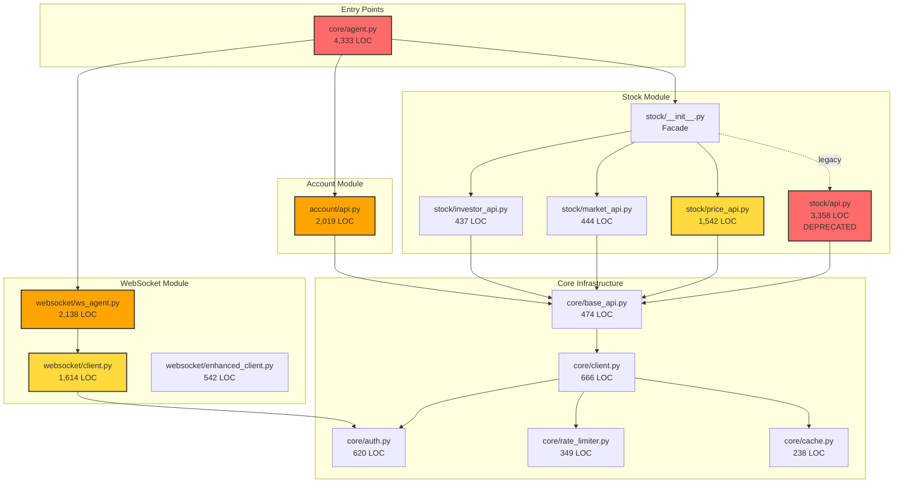
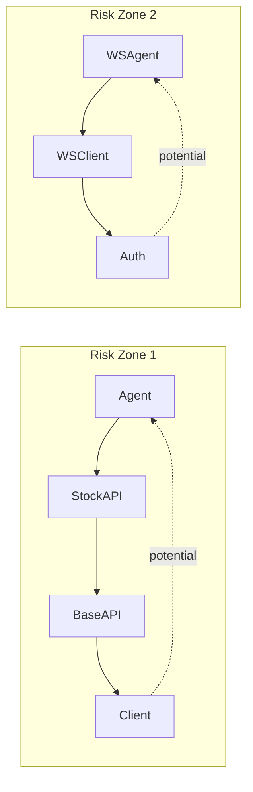

# LOC Refactor: 의존성 그래프 및 분해 계획

> **생성일**: 2026-01-03
> **브랜치**: `refactor/loc-gate-compliance`
> **관련 이슈**: INT-348 ~ INT-353

## 1. 현재 상태 (Before)

### 1.1 LOC 초과 파일 현황

```
┌─────────────────────────────────────────────────────────────────────────────┐
│                        LOC Gate Status: FAILED                              │
│                        Threshold: 1,500 lines                               │
├─────────────────────────────────────────────────────────────────────────────┤
│                                                                             │
│  core/agent.py         ████████████████████████████████████████  4,333 (+2,833)
│  stock/api.py          ██████████████████████████████████        3,358 (+1,858)
│  websocket/ws_agent.py █████████████████████                     2,138 (+638)
│  account/api.py        ████████████████████                      2,019 (+519)
│  websocket/client.py   ████████████████                          1,614 (+114)
│  stock/price_api.py    ███████████████                           1,542 (+42)
│                                                                             │
│  ──────────────────────────────────────────────────────────────────         │
│  Total Exceeding: 6 files | Total Excess: 6,004 lines                       │
└─────────────────────────────────────────────────────────────────────────────┘
```

### 1.2 모듈 의존성 그래프



---

## 2. 목표 상태 (After)

### 2.1 분해 후 예상 구조

```mermaid
graph TB
    subgraph "Entry Points"
        Agent[core/agent.py<br/>~400 LOC]
    end

    subgraph "Core - Extracted"
        OrderMgr[core/order_manager.py<br/>~600 LOC]
        QueryMgr[core/query_manager.py<br/>~500 LOC]
        Session[core/session.py<br/>~300 LOC]
    end

    subgraph "Stock Module - Reorganized"
        StockFacade[stock/__init__.py<br/>Facade]
        PriceAPI[stock/price_api.py<br/>~1,200 LOC]
        MarketAPI[stock/market_api.py<br/>~600 LOC]
        InvestorAPI[stock/investor_api.py<br/>~600 LOC]
        DerivAPI[stock/derivatives_api.py<br/>~400 LOC NEW]
        IndexAPI[stock/index_api.py<br/>~300 LOC NEW]
        StockAPILegacy[stock/api.py<br/>~200 LOC<br/>Wrapper Only]
    end

    subgraph "Account Module - Split"
        AccountFacade[account/api.py<br/>~400 LOC]
        OrderAPI[account/order_api.py<br/>~500 LOC NEW]
        ReservAPI[account/reservation_api.py<br/>~200 LOC NEW]
        ProfitAPI[account/profit_api.py<br/>~400 LOC NEW]
        Pagination[account/pagination.py<br/>~350 LOC NEW]
    end

    subgraph "WebSocket Module - Decomposed"
        WSAgent[websocket/ws_agent.py<br/>~800 LOC]
        WSConn[websocket/connection.py<br/>~400 LOC NEW]
        WSSub[websocket/subscription.py<br/>~300 LOC NEW]
        WSClient[websocket/client.py<br/>~1,000 LOC]
        WSUtils[websocket/utils.py<br/>~200 LOC NEW]
    end

    Agent --> OrderMgr
    Agent --> QueryMgr
    Agent --> Session

    Agent --> StockFacade
    Agent --> AccountFacade
    Agent --> WSAgent

    StockFacade --> PriceAPI
    StockFacade --> MarketAPI
    StockFacade --> InvestorAPI
    StockFacade --> DerivAPI
    StockFacade --> IndexAPI
    StockFacade -.->|deprecated| StockAPILegacy

    AccountFacade --> OrderAPI
    AccountFacade --> ReservAPI
    AccountFacade --> ProfitAPI
    OrderAPI --> Pagination

    WSAgent --> WSConn
    WSAgent --> WSSub
    WSConn --> WSClient
    WSClient --> WSUtils

    style Agent fill:#2ecc71,stroke:#333,stroke-width:2px
    style OrderMgr fill:#3498db,stroke:#333,stroke-width:2px
    style QueryMgr fill:#3498db,stroke:#333,stroke-width:2px
    style Session fill:#3498db,stroke:#333,stroke-width:2px
    style DerivAPI fill:#9b59b6,stroke:#333,stroke-width:2px
    style IndexAPI fill:#9b59b6,stroke:#333,stroke-width:2px
    style OrderAPI fill:#e74c3c,stroke:#333,stroke-width:2px
    style ProfitAPI fill:#e74c3c,stroke:#333,stroke-width:2px
    style WSConn fill:#f39c12,stroke:#333,stroke-width:2px
    style WSSub fill:#f39c12,stroke:#333,stroke-width:2px
```



### 2.2 예상 LOC 분포

```
┌─────────────────────────────────────────────────────────────────────────────┐
│                        LOC Gate Status: PASSED                              │
│                        Threshold: 1,500 lines                               │
├─────────────────────────────────────────────────────────────────────────────┤
│                                                                             │
│  stock/price_api.py    ████████████                               1,200     │
│  websocket/client.py   ██████████                                 1,000     │
│  websocket/ws_agent.py ████████                                     800     │
│  core/order_manager.py ██████                                       600     │
│  stock/market_api.py   ██████                                       600     │
│  stock/investor_api.py ██████                                       600     │
│  account/order_api.py  █████                                        500     │
│  core/query_manager.py █████                                        500     │
│  core/agent.py         ████                                         400     │
│  account/api.py        ████                                         400     │
│  ...                                                                        │
│                                                                             │
│  ──────────────────────────────────────────────────────────────────         │
│  All files under threshold                                                  │
└─────────────────────────────────────────────────────────────────────────────┘
```

---

## 3. 분해 상세 계획

### 3.1 core/agent.py (4,333줄 → ~1,800줄 분산)

| 추출 대상 | 새 모듈 | 예상 LOC | 책임 |
|-----------|---------|----------|------|
| 주문 관련 메서드 | `core/order_manager.py` | ~600 | order_cash, order_credit, order_rvsecncl 등 |
| 조회 결과 처리 | `core/query_manager.py` | ~500 | 결과 파싱, 변환, 캐싱 로직 |
| 세션/인증 관리 | `core/session.py` | ~300 | 인증 상태, 토큰 관리 |
| Facade 유지 | `core/agent.py` | ~400 | 초기화, 위임, 프로퍼티 |

**위임 패턴 예시**:
```python
# core/agent.py (After)
class Agent:
    def __init__(self, ...):
        self._session = Session(...)
        self._orders = OrderManager(self._session)
        self._queries = QueryManager(self._session)
        self._stock = StockAPI(self.client)
        self._account = AccountAPI(self.client)

    def order_cash(self, *args, **kwargs):
        return self._orders.order_cash(*args, **kwargs)
```

### 3.2 stock/api.py (3,358줄 → ~200줄)

**현재 문제**: DEPRECATED지만 여전히 모든 메서드가 구현되어 있음

| 메서드 그룹 | 이동 대상 | 메서드 수 |
|-------------|-----------|-----------|
| 선물/옵션/ELW/VI | `stock/derivatives_api.py` (신규) | ~10 |
| 지수 조회 | `stock/index_api.py` (신규) | ~8 |
| 시세 조회 | `stock/price_api.py` (보강) | ~25 |
| 시장 정보 | `stock/market_api.py` (보강) | ~15 |
| 투자자 동향 | `stock/investor_api.py` (보강) | ~20 |

**최소화된 api.py**:
```python
# stock/api.py (After - Wrapper Only)
import warnings
from .price_api import StockPriceAPI
from .market_api import StockMarketAPI
# ... imports

class StockAPI(StockPriceAPI, StockMarketAPI, ...):
    """DEPRECATED: Use 'from kis_agent.stock import StockAPI'"""
    def __init__(self, *args, **kwargs):
        warnings.warn("Use 'from kis_agent.stock import StockAPI'",
                      DeprecationWarning, stacklevel=2)
        super().__init__(*args, **kwargs)
```

### 3.3 account/api.py (2,019줄 → ~1,850줄 분산)

| 추출 대상 | 새 모듈 | 예상 LOC |
|-----------|---------|----------|
| 현금/신용 주문 | `account/order_api.py` | ~500 |
| 예약 주문 | `account/reservation_api.py` | ~200 |
| 손익 조회 | `account/profit_api.py` | ~400 |
| 페이지네이션 | `account/pagination.py` | ~350 |
| Facade 유지 | `account/api.py` | ~400 |

**대형 메서드 분해**:
- `_inquire_daily_ccld_pagination` (342줄) → `pagination.py`
- `inquire_daily_ccld` (274줄) → 모드별 분리 검토

### 3.4 websocket 모듈 (3,752줄 → ~2,700줄 분산)

| 파일 | 현재 | 목표 | 추출 내용 |
|------|------|------|-----------|
| `ws_agent.py` | 2,138 | ~800 | connection.py, subscription.py |
| `client.py` | 1,614 | ~1,000 | utils.py, parsers.py |

---

## 4. 순환 의존성 검사

### 4.1 잠재적 위험 영역



**완화 전략**:
1. 의존성 주입 (Dependency Injection) 사용
2. 인터페이스/프로토콜 분리
3. 지연 import (lazy import) 패턴

### 4.2 안전한 분해 순서

```
Phase 1: 기반 작업 (현재)
    └── LOC 스크립트, 의존성 분석

Phase 2: core/agent.py
    ├── 1. session.py 추출 (독립적)
    ├── 2. query_manager.py 추출
    └── 3. order_manager.py 추출

Phase 3: stock/api.py
    ├── 1. derivatives_api.py 생성
    ├── 2. index_api.py 생성
    └── 3. api.py 최소화

Phase 4: account/api.py
    ├── 1. pagination.py 추출 (독립적)
    ├── 2. profit_api.py 추출
    └── 3. order_api.py 추출

Phase 5: websocket
    ├── 1. utils.py 추출
    ├── 2. connection.py 추출
    └── 3. subscription.py 추출
```

---

## 5. 검증 체크리스트

### 5.1 각 Phase 완료 시 확인 사항

- [ ] `python scripts/check_loc.py` 실행
- [ ] `pytest tests/unit/ -v` 통과
- [ ] Import 에러 없음 확인
- [ ] 기존 예제 코드 동작 확인

### 5.2 최종 검증

```bash
# LOC 게이트 통과
python scripts/check_loc.py --threshold 1500

# 테스트 통과
pytest tests/unit/ -v --cov=pykis

# 린트 통과
ruff check pykis/
```

---

## 6. 참고 자료

- PRD: `.taskmaster/docs/prd-loc-refactor.md`
- CI/CD: `.github/workflows/ci.yml`
- 기존 아키텍처: `docs/architecture/websocket-architecture.md`
